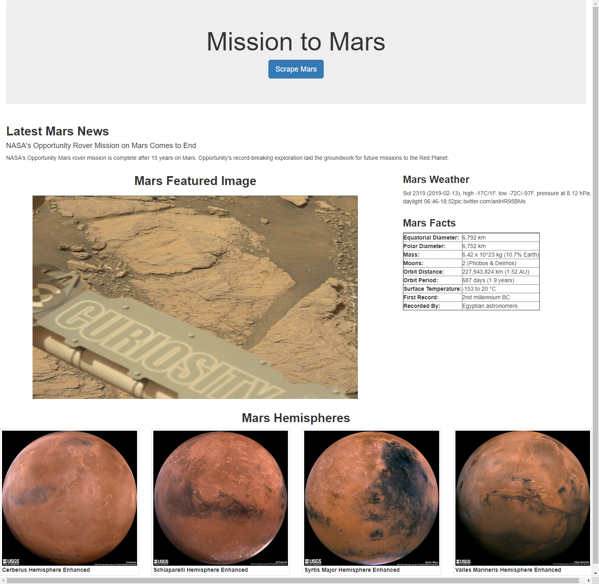

# Mission to Mars

This project involved a web application build that scraped various websites for data related to Mars which was then displayed on a single HTML page.

Scraping and analysis were completed using Jupyter Notebook, BeautifulSoup, Pandas, and Requests/Splinter.  Mongo DB with Flask templating was used to create the HTML page that displays the data scraped from the various websites.  See below for HTML.

© 2019 Trilogy Education Services. All Rights Reserved.

